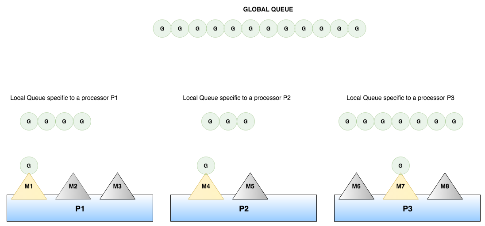
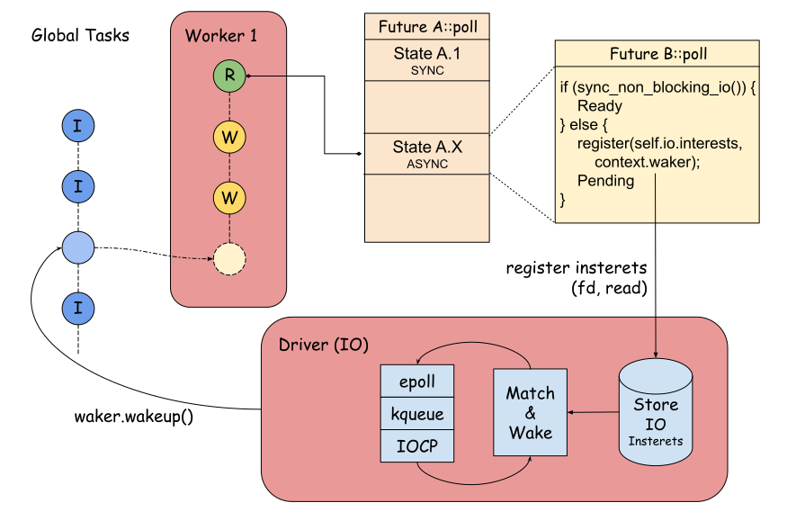

> 协程是对子程序（subroutine）的一种扩展，它允许执行流程被挂起和恢复 [1]。

随着越来越多的编程语言的支持，协程这个概念也被更多的人所知晓。协程定义了一种通用的控制流的交互方式。
通常来说（根据最初的定义），协程的执行是协作式的。换句话说，控制流的转移是主动的、协作的，这与线程的抢占式调度有着很大的区别。
使用协程可以很优雅地实现一些概念，比如事件循环、迭代器、无限长的列表（generator）等，举一个经典的 Python 的例子：

```python3
# 实现一个无限长的从 0 开始的 range
# yield 时挂起当前协程，并把控制权交给 caller
def infinite_range():
    i = 0
    while True:
      yield i
      i += 1
```

目前已经有很多语言原生地支持了协程，比如 Python、Kotlin、Go 和 Rust 等。本文主要想聊一下其中的两个语言：Go 和 Rust。这两个语言典型地代表了协程的呈现和实现方式，对于理解协程有比较好的帮助。

注：虽然 Go 的 goroutine 通常也被归类为协程，但是协程的古典概念还是应该是协作式子例程。Go 在 1.14 版本实现了 [3] 中提出的非协作式抢占，也就是抢占式调度。Go 官方为了和进程、线程、协程等已有概念作区别新创了 goroutine 这个词 [2]。我个人也更喜欢用 goroutine 来指代 Go 中实现的轻量级并发的概念。

## 协程

关于支持协程的理由不再过多介绍，本文主要想以 Rust 和 Go 为例，聊一下协程的几种形式、实现和现状。

协程的编程模型有很多种，最常见的就是 async/await 模型，Rust 提供的就是这种。相对而言，Go 提供的 `go` 关键字更像启动一个用户态线程，使用起来比 async/await 更加简洁。

在实现上，通常分为两种，也就是常说的有栈协程和无栈协程。这里的栈指的是每个协程是否拥有独立的栈空间，像 Go 提供的 goroutine 是典型的有栈实现，每一个 goroutine 在自己的栈空间上执行。而 Rust 提供的则是典型的无栈协程，无栈协程的运行方式类似于一个巨大的状态机。这么说你可能不能一下子在脑中构建运行时的状态，待会会展开讲讲 Rust 是如何运行它的协程的。

如前文所说，协程通常是协作式的，但现代的一些高级编程语言还是实现了抢占式的调度。在介绍 goroutine 的过程中，本文也会大概介绍下协作式和抢占式的原理，以及相应的理由和演进过程。

### Go -- Just go

熟悉 Go 语言的同学都知道，它提供了一个简单易用的并发使用方式 -- `go`。通过在函数调用前加上 `go` 关键字，就可以并发地执行它的逻辑：

```go
func handleTasks(ctx: context.Context, taskChan: <- chan Task) {
    for {
        select {
            case <- ctx.Done():
                return
            case task := <- taskChan:
                handle(ctx, task)
        }
    }
}

func startTaskHandler(ctx: context.Context, taskChan: <- chan Task) {
    // With simple `go`, we start a task handler which runs in the 
    // background asynchronously and concurrently.
    go handleTasks(ctx, taskChan)
}
```

上面的示例中启动了一个异步的任务处理器。Go 将它启动的异步单元称为 goroutine -- 它看上去更像是一个线程。当然，本文还是以协程的视角来描述 Go 中 goroutine 的模型和运行方式，因此以下的协程也代指 goroutine。

Go 的协程实现是所谓的有栈协程。每一个协程在启动的时候，runtime 都需要为它分配一块栈内存 -- 之后协程的运行就发生在这一块栈上。有栈协程的运行方式很像线程，因此相比于抽象的无栈协程，也更加的容易理解。在有栈协程的实现中，每一个协程都可以是一个可调度的单元，也就是说只要环境支持，可以并行（而非并发）地运行。

同操作系统提供的线程一样，协程在执行一些阻塞调用的时候会陷入 runtime，由 runtime 来负责阻塞调用的转换/执行、以及后续的调度。同样，当对应调用完成时 runtime 会唤醒对应的协程，重新调度执行它。当然实际上的情况要更加复杂一点，比如，思考一下 Linux 上文件 IO 和网络 IO 的调用会有什么不同？

当然，Go 中协程的切换方式并不是只有阻塞调用这一种。Go 为了协程调度的公平起见（防止 CPU 密集协程占满计算资源把其他协程饿死），设计了一些切换点（suspend point），经典的比如：

+ 函数调用检查：调用函数时检查是否应该让出控制权
+ 循环回边检查：下一次循环开始前检查是否应该让出控制权

早期的 Go 没有循环回边检查，导致了在一些场景下程序整个 hang 死的情况。这些切换点被 Go 的编译器自动地编织到代码中。通过这种方式，Go 实现了所谓的“协作式”调度。可以想见，为了性能考虑，这些检查的实现方式无非是通过计数器来判断当前调用/循环累计次数是否到达阈值，或是当前已执行时间是否达到阈值，从而判断该不该切换了。（思考一下，为啥不能统统判断执行时间？）

```go
// Cooperative Preemption
func doSomething() {
    // Compiler inserts (Just example).
    runtime.CheckIfWeAreGoingToBeSched() 

    // Do something...
}

func doSomethingInLoop() {
    for i := 0; i < 1e8; i ++ {
        // Compiler inserts (Just example).
        if i % 1e7 == 0 {
            runtime.GoSched()
        }
        // Do something...
    }
}
```

这种方式虽然在能解决问题，但在一些紧的循环（tight loop）还是会造成无法接受的性能下降。因此在 [3] 中 Austin 提出了非协作式的调度，并且 Go 在 1.14 中首次实现了基于 signal 的抢占式调度。个人认为，从这里开始 goroutine 和经典协程的定义越来越远，更接近于用户态线程。

Go 的调度模型 MPG 相信也是大名鼎鼎了，这里不再赘述，放一张从 [8] 中借鉴的图：



当然，Go 目前的调度实现和诸如 Linux 的线程调度实现还是有所区别的，例如它还无法支持 goroutine 的优先级设置。根据 TYGG 的说法，TiDB 在项目过程中因为 TSO goroutine 的阻塞导致了系统整体性能的下降，这仍然是一个值得优化的点。

### Rust -- async/await

相信每一个 Rust 新手都看过这篇介绍 Asynchronous Programming 的文档 [4]，但是这篇文档属实有一点新手不友好，看完以后还是一头雾水。因此我决定在本篇中着重介绍下 Rust 的模型，以及它是如何被运行起来的。

Rust 的协程采用的是常见的 async/await 模型。`async` 标志了对应的代码块是可以异步运行的，对应了一个协程。`await` 则代表等待异步执行结束，对应异步代码块中对协程的调用。采用 async/await 可以让开发者用一种同步的方式编写异步代码，因此颇受欢迎。但是 async 和 sync 的不同的编程模型，使得对同步代码的异步化改造将会非常困难，通常需要从底层开始重写。相比之下，Go 在这方面更加友好。

#### Future

Async/Await 的模型的通常是通过无栈协程实现的。如前文所述，无栈指的是协程没有一个独立的栈。在协程运行时，是和其他协程用的同一块栈空间。Rust 的 async 语义实现非常直接，它就是一个编译器提供的语法糖 -- 将 async 的代码块/函数等价转成返回一个 Future 的代码块/函数，如下所示：

```rust
async fn do_something_async() -> u32 {
    // user codes
    // ...
}

// 等价于
fn do_something_async() -> impl Future<Output: u32> {
    Future {
        // compiler specific transform
        // ...
    }
}
```

这个 Future 就代表了协程，它内部是一个状态机。Future 在 Rust 里是一个 trait：

```rust
pub trait Future {
    type Output;
    fn poll(self: Pin<&mut Self>, cx: &mut Context<'_>) -> Poll<Self::Output>;
}

pub enum Poll<T> {
    Ready(T),
    Pending,
}
```

Future 提供了一个 poll 函数，我们先不管参数里面 Pin 和 Context 是什么意思。从声明上看，它的执行方式就是循环地调用 Future::poll，直到返回 Ready 表示执行完成。

到目前为止，我们并不需要关心 Future 内部是如何实现的，只要知道执行 poll 它就能运行下去了。显然，poll 是一个被动式的接口，需要一个 runtime 不停地驱动它执行。遗憾的是，在 Rust 的标准库中这一部分是缺失的。目前在 Rust 上能提供 runtime 的有几个三方库，其中包括著名的 tokio 和 async-std。以后聊 Rust 异步并发的时候，tokio 的实现是我重点参考的对象。

假设我们已经有一个 runtime 能够调用 poll 来驱动 Future 所代表的的协程往前推进了，那么很有可能 Future::poll 的第一次调用并不会返回 Ready。这个时候我们需要考虑一个问题：什么时候需要再次执行这个 Future？

Rust 显然已经考虑过这个问题了，它在标准库里提供了一个叫 Waker 的类型：

```rust
pub struct Waker { /* fields omitted */ }

impl Waker {
    // 当 wake 或者 wake_by_ref 被调用时，意味着对应的 Future 需要被再次执行
    pub fn wake(self);
    pub fn wake_by_ref(&self);
}
```

直观地想，好像不同的 Future 需要有不同的 Waker。但实际上不是这个意思，Waker 只是通知 runtime 某个协程可以继续执行了，因此 runtime 只需要把协程加入待运行队列就好。Rust 中 Waker 的自定义方式比较特殊，它需要手动地绑定对应的数据和函数的指针（vtable），从而达到自定义 Waker 的目的，有兴趣的同学可以自行了解下。有了 Waker 之后，我们就可以定义什么时候将 Future 再次唤醒并执行了。当然里面还涉及到一些问题，大家先有这么一个概念就好，待会会一一细说。

现在来看一个简单的 async 代码：

```rust
use tokio::io::{self, AsyncReadExt};
use tokio::net::TcpStream;

async fn echo_handle(socket: TcpStream) -> io::Result<()> {
    let mut buf = vec![0; 1024];
    // Loop writing everything read from socket.
    loop {
        match socket.read(&mut buf).await? {
            Ok(0) => {
                // Remote has closed, break loop.
                break;
            }
            Ok(n) => {
                // Copy the data back to socket.
                socket.write_all(&buf[..n]).await?;
            }
        }
    }
    Ok(())
}
```

这段代码实现了一个简易 echo server 的 handler，其中出现了 await 这个关键字。众所周知，await 语义上表示异步等待 async 完成，在 Rust 的实现中也就是等待对应的 Future 完成。我们稍微抽象一下，上面的代码从运行结构上来说大概长这样：

```rust
async fn echo_handle() {
    // Do something synchronous here.
    // ...

LOOP:
    // Create the first future.
    let fut1 = create_socket_read_fut();
    let res = fut1.await;

    // Do something else synchronous here.
    // ...

    // Create the second future.
    let fut2 = create_socket_write_all_fut();
    fut2.await;

    // Do something synchronous here.
    // ...

    goto LOOP;

    // Do the left, either synchronously or asynchronously, 
    // or loop from the some block above.
    // ...
}
```

所以 await 是怎么实现的？与 async 一样，await 是 Rust 语言提供的另一个语法糖，编译器会自动将它转换成对 poll 的调用。最终这段代码将变成如下的样子：

```rust
enum State {
    Sync(u32),
    Async(u32),
}

struct EchoHandleFuture {
    state: State,
    fut1: Pin<&mut SocketRead>,
    fut2: Pin<&mut SocketWrite>,
    // other contexts...
}

impl Future for EchoHandleFuture {
    type Output = ();

    pub fn poll(self: Pin<&mut Self>, cx: &mut Context<'_>) -> Poll<Self::Output> {
        loop {
            match self.state {
                Sync(STATE_1) => {
                    self.sync_block_1();
                    self.state = Sync(STATE_2);     // Go to STATE_2 sync;
                }
                Sync(STATE_2) => {
                    self.fut1 = pin!(self.create_socket_read_fut());
                    self.state = Async(STATE_3);    // Go to STATE_3 async;
                }
                Async(STATE_3) => match self.fut1.poll(cx) {
                    Pending => return Pending,      // Wait until fut1 ready;
                    Ready(_) => {
                        // Record the result here.  
                        self.state = Sync(STATE_4); // Go to STATE_4 sync;
                    }
                },
                Sync(STATE_4) => {
                    self.sync_block_2();            
                    self.state = Sync(STATE_5);     // Go to STATE_5 sync;
                }
                Sync(STATE_5) => {
                    self.fut2 = pin!(self.create_socket_write_all_fut());
                    self.state = Async(STATE_6);    // Go to STATE_6 async;
                }
                Async(STATE_6) => match self.fut2.poll(cx) {
                    Pending => return Pending,      // Wait until fut2 ready;
                    Ready(_) => {
                        self.state = Sync(STATE_7); // Go to STATE_7 sync;
                    }
                },
                Sync(STATE_7) => {
                    self.sync_block_3();
                    self.state = Sync(STATE_2);     // Loop from STATE_2, i.e. fut1;
                },
                // Other states, either sync or async.
                // ...
            }
        }
        Ready(()) // Finally we are ready.
    }
}
```

这一段代码是我人肉翻译的，没有细究 Rust 编译器的真实行为，但基本的思想是一致的。可以看到上述的状态机中，因为在展开过程中无法得知 runtime，context 是简单地从父 Future 一路传递给子 Future。同样，Rust 在编译时也无法得知 runtime 的存在，因此无法做出额外的操作，也是简单的传递 context，这在特殊情况下会引起奇怪的问题 [7]。
既然我们已经知道的状态机的形状，我们可以得知以下两个信息：

+ async 代码块/函数是顺序执行的，它内部可以存在两个 future 是并发的，但绝对不会是并行（in parallel）的
  + 细心的同学会发现 await 并不能实现并发，例子中 fut1 和 fut2 就是顺序执行的，但实际上我们可以简单用如下方式实现两个 Future 的交替执行（并发），用这种思想我们可以实现很多有意思的语义，比如 select / join all 等；

```rust
struct JoinFuture<F1, F2>
where
    F1: Future<Output = ()>,
    F2: Future<Output = ()>,
{
    fut1: Pin<&mut F1>,
    fut1_done: bool,
    fut2: Pin<&mut F2>,
    fut2_done: bool,
}

impl<F1, F2> Future for JoinFuture<F1, F2>
where
    F1: Future<Output = ()>,
    F2: Future<Output = ()>,
{
    type Output = ();

    pub fn poll(self: Pin<&mut Self>, cx: &mut Context<'_>) -> Poll<Self::Output> {
        if !self.fut1_done {
            if let Ready(_) = self.fut1.poll(cx) {
                fut1_done = true;
            }
        }
        if !self.fut2_done {
            if let Ready(_) = self.fut2.poll(cx) {
                fut2_done = true;
            }
        }

        if self.fut1_done && self.fut2_done {
            Ready(())
        } else {
            Pending
        }
    }
}
```

+ runtime 在没有运行起来前，是无法感知 async 代码块中的子 Future 的存在的

所以，所有的 async runtime 的基本调度单位都是顶层的 Future，通常它们会被封装成一个 Task。Task 内部的运行一定不是并行的，Task 间才能并行。因此类似 tokio 等运行时实现都提供了和线程一样的 `spawn` 方法用来启动一个可以并行执行的协程。为了方便起见，之后将 runtime 能感知的顶层 Future 统称为任务（Task），它是 runtime 的基本调度单位。

#### Waker

在了解了 Rust 中协程的呈现形式 -- async/await 的基本原理之后，我们来看一下之前所说的 Waker。

在任务的完整运行过程中，可能会涉及到多次暂停、恢复的过程。显然，每次的任务的唤醒条件都可能不同。以上面的代码为例，socket.read 需要在对应的 socket 有读事件时唤醒，而 socket.write 需要在有写事件时唤醒，因此运行时是无法在一开始就得知任务需要在何时唤醒的。现在我们可以关注 Future::poll 的 Context 参数了，从文档中我们可以得知 Context 主要用于获取自身 waker 的引用。调用 waker.wake() 可以将所在的任务唤醒，即重新加入调度队列。Rust 的这种设计将 Waker 和事件驱动器的绑定下推给了一些基本的 Future，例如 SocketRead。当 SocketRead 需要让出控制权前，需要将它的 Waker 和事件驱动器绑定起来，从而保证事件驱动器中的事件发生时会将它所在的任务唤醒起来。当然，这些基本 Future 和事件驱动器都需要有人实现，并由运行时启动起来。

在运行期间，Future 获取的 Waker 是由运行时传递进来的，理论上来说它仅能感知 Future 所在的任务。设想我们有如下代码：

```rust
async fn do() {
    let fut1 = do_action1();
    let fut2 = do_action2();

    join_all!(fut1, fut2).await;
}
```

其中 `join_all` 的语义是完成所有的子任务。在上文中有一个该语义的简单实现：每当任务被唤醒时，poll 一下所有的子 Future 来推进运行状态。显然，当子 Future 数量多时，这个实现会出现性能问题。在 `futures` 这个 crate 中提供了一个实现 `FuturesUnordered`，它针对大量子 Future 的 join 做了一个优化：任务被唤醒的时候只有相应的 Future 被再次 poll，也就是实现了对任务内部 Future 的感知。简单来说，`FuturesUnordered` 维护了一个 active 的 Future 的队列，且在 poll 内部 Future 时使用了它增强过后的 Waker -- 在 wake 的同时将 Future 放入 active 队列中。实现细节可以参考代码，这里不再赘述。

#### Yield

Future 的执行是一种被动拉取的方式，其中的控制权转移也是在执行时隐式地发生。如果我们想要显示地转移控制权呢？分为以下三种情况：

1. 控制权交还给运行时
2. 控制权立即交给另一个协程
3. 控制权交给调用者，通常同时返回一个值由调用者处理

对应的伪代码如下所示：

```rust
yield           // 1
yield to A      // 2
yield a         // 3
```

第一种控制权转交给运行时在 Rust 中时刻在发生，根据之前所述的原理，我们也可以简单地实现一个 yield。

```rust
pub struct Yield {
    yielded: bool,
}

impl Future for Yield {
    type Output = ();

    fn poll(self: Pin<&mut Self>, cx: &mut Context<'_>) -> Poll<Self::Output> {
        if self.yielded {
            return Poll::Ready(());
        }
        self.yielded = true;
        cx.waker().wake_by_ref();
        Poll::Pending
    }
}

fn yield() -> Yield {
    Yield { yielded : false }
}

async fn with_yield() {
    // Yield once.
    yield().await;
}
```

第二种立即转交控制权的一个典型的例子就是两个协程 ping-pong，目前我还没有了解到 Rust 下有什么方式实现这种控制权转移。

第三种通常特化成 generator，在 Rust 中对应的模型是 Stream，可以理解为是一个异步的迭代器。Stream 目前还不是一个稳定的 feature。

```rust
pub trait Stream {
    type Item;

    fn poll_next(
        self: Pin<&mut Self>, 
        cx: &mut Context<'_>
    ) -> Poll<Option<Self::Item>>;

    fn size_hint(&self) -> (usize, Option<usize>) { ... }
}

async fn handle() {
    let stream = new_stream();

    while let Some(item) = stream.next().await {
        process(item).await;
    }
}
```

#### Runtime

总结一下，Rust 的协程的运行时大概如下图所示（仅以 IO 为例）：



## 总结

本文主要聊了聊 Rust 和 Go 两种编程语言中协程的编程模型和大致原理，也算是补全了我对无栈协程运行方式的了解。由于篇幅受限，这里有一些方面无法一一展现，比如 Rust 协程的取消、并发模型的对比等，可能会在后续的文章中讨论。

水平有限，错误疏漏在所难免，还希望各路大佬不吝赐教。

P.S. 评论系统换成了 beaudar，感觉还不错，欢迎留言探讨 😀。

## 参考文献

[1] <https://en.wikipedia.org/wiki/Coroutine>

[2] <https://golang.org/doc/effective_go#goroutines>

[3] <https://github.com/golang/proposal/blob/master/design/24543-non-cooperative-preemption.md>

[4] <https://rust-lang.github.io/async-book/>

[5] <https://samsartor.com/coroutines-1/>

[6] <https://en.wikipedia.org/wiki/Async/await>

[7] <https://stackoverflow.com/questions/60964709/why-do-i-not-get-a-wakeup-for-multiple-futures-when-they-use-the-same-underlying>

[8] <https://riteeksrivastava.medium.com/a-complete-journey-with-goroutines-8472630c7f5c>

[9] <https://rakyll.org/scheduler/>
