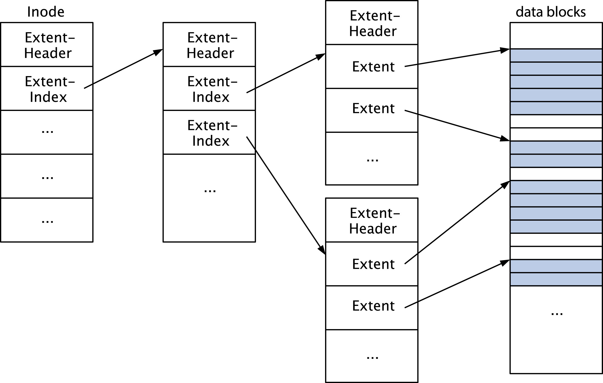
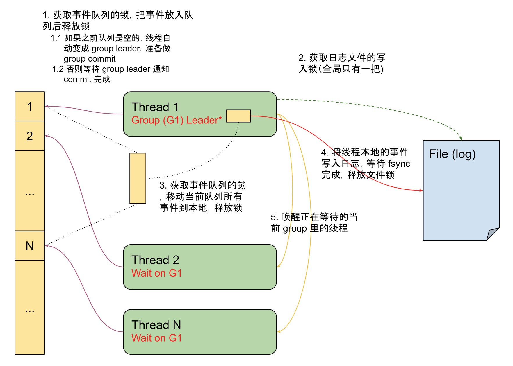

众所周知，数据库管理系统需要满足数据操作的持久性，即保证操作的请求在返回之前，对应的数据一定是已经保存在非易失性存储中 -- 通常来说，就是磁盘。而大多数数据库系统都是构建在操作系统提供的文件系统之上的，因为不同的存储设备往往有着不同的特性和交互方式，操作系统和文件系统帮助屏蔽了物理细节。当然也不排除直接使用块设备操作或是使用用户空间驱动 (e.g. SPDK) 操作的，其优化思想应当是一样的，本文不做额外讨论。

## 存储

### Buffered / Direct IO

操作系统和文件系统对存储做了层层封装，最终提供给我们这些通用的操作方式，如下 C 函数所示（摘抄自 macOS 的 manual）：

```C
// 打开文件描述符
int open(const char *path, int oflag, ...);
// 关闭文件描述符
int close(int fd);

// 顺序读写
ssize_t read(int fd, void *buf, size_t nbyte);
ssize_t write(int fd, const void *buf, size_t nbyte);

// 指定 offset 读写
ssize_t pread(int fd, void *buf, size_t nbyte, off_t offset);
ssize_t pwrite(int fd, const void *buf, size_t nbyte, off_t offset);
```

这里面有个不可避免的问题：当我进行一次文件操作的时候，它是否已经写入了磁盘，aka. 即使断电也不会丢失？了解过操作系统的同学都知道，为了优化性能，操作系统通常会提供一种叫 page cache 的东西。

+ 当使用 read 操作进行一次读取的时候，如果此时对应文件磁盘区域的 page cache 不存在，操作系统会先将对应的内容读取出来，存放到 page cache 中，然后在其中拷贝对应的内容到用户给的 buffer 中，再返回给用户；
+ 当使用 write 操作进行一次写入的时候，同样也会先准备好 page cache，然后将对应的内容拷贝到 page cache 上，此时立即返回给用户程序告知写入成功；
  + 当写入成功时，对应 page cache 的数据和磁盘上的数据已经存在差异了，操作系统将负责将它回写到磁盘上，用一种 **异步的** 方式；

这种方式通常被称为 buffered IO，相对应的也会有另一种 unbuffered IO，马上会进行介绍。值得注意的是，写入操作并不是到达磁盘才返回的，因此用户程序此时还没有办法知道自己的数据是否已经持久化了，我们暂且先放一下，先看看它有什么优缺点。

在普遍的读写负载下，buffered IO 要比 unbuffered IO 快出几个数量级，主要有以下几个原因：

+ 大多数非易失性存储的读写模式都不是按照 byte 来的，而是按照块为单位，一次读写的最小单位就是块。在早期的磁盘上这个数字是 512 bytes（对应一个扇区），SSD 上则是 4096 bytes（对应一个页）。这意味着 1 byte 的修改要写入磁盘就要额外引入 511 或者 4093 个 bytes 的写入，本来就不富裕的磁盘带宽更会雪上加霜；
  + 题外话，Intel 家的 Optane 设备最小写入单位是 8 bytes 我记得，属实有一点离谱
+ 当引入 page cache 后，在同一个 page 上进行的多次操作可以合并成一次磁盘写入操作，不仅符合块读取/写入的规定，而且有效减少了磁盘操作；
+ 另外，操作系统并不是傻傻地等着应用程序读取/写入时才准备 page cache，根据访问模式/用户 advice，操作系统会提前读取磁盘内容到内存中，使得 CPU 和磁盘更充分的被（同时）使用起来，从而提升应用程序 IO 操作的响应速度；

综上，操作系统默认就会打开 page cache 来提升性能。但由于控制 page cache 的操作系统无法完全预测应用程序的行为，反而会导致某些应用程序无法有效利用磁盘，例如数据库管理系统。不必惊慌，想必很多同学都了解过 direct (unbuffered) IO，可以关闭操作系统的 page cache，让每一次读写都直接*经过*磁盘。几乎所有的操作系统都提供了 direct IO，例如在 Linux 上我们用这种方式打开文件：

```C
int fd = open("/path/to/file", O_CREAT | O_RDWR | O_DIRECT);
```

就获得了一个关闭 page cache 的文件描述符。此时再进行 read/write 操作时，会直接对磁盘设备进行请求。由于请求的特殊性（DMA 操作），Linux 甚至对传入 read/write 的参数有额外的要求：buf 的地址要做到扇区对齐，且大小是扇区的整数倍。显然，在类似顺序写（日志文件）这种场景中，direct IO 省去了内存拷贝，也更能完全发挥磁盘的性能。也正因此，数据库系统会倾向于使用 direct 的方式来写它的 write-ahead log（WAL）。

听起来到这里我们就已经能保证数据库管理系统的持久性了：用 direct 的方式写 WAL，写入成功意味着磁盘上持久化成功了，可是真的如此么？

### 同步写 (Synchronized Write)

熟悉 Linux 几个文件接口的同学一定知道，除了上述我列出的一些参数和接口以外，还有如下的几个参数和接口：

```C
O_SYNC                  // 同步写，操作系统将尽可能等待数据真的写入到对应的设备
O_DSYNC                 // 同步写，和上面有所区别的是只等待数据写入到对应的设备

int fsync(int fd);      // 同步文件修改，操作系统将尽可能地将所有文件修改写入到设备
int fdatasync(int fd);  // 同步文件修改，不过也是只等待数据和数据相关元数据写入设备
```

为什么要有这些参数和接口？因为除了操作系统有缓存，存储设备也有缓存（你搁这套娃呢），而direct write 只是将用户的 buffer 拷贝到了存储设备的缓存之中。当然热心的同学可能要问了，存储设备的缓存有什么用？AFAIK [5]，

+ 缓存读取，除了操作系统会做 prefetch，存储设备也会做；
+ 缓存写入，缓存的一大重要意义就是把比如脉冲式地写入拉平，并且可以立即返回给用户；
+ 缓存指令，存储设备可以将读写指令缓存起来，并合理重排指令顺序（思考一下一秒 5000 转的磁盘）使得性能最大化；

因此使用 direct write 还是不能肯定数据到磁盘了，可太辛苦了。不过既然有缓存，一定有控制缓存的方式，比如刷缓存，而其中一种方式叫做 FUA（Force Unit Access）。FUA 会强制等待写入指令直到数据进入磁盘为止，有一些系统使用 FUA 实现 O_SYNC/O_DSYNC 来保证数据同步到设备之上了。与此同时，fsync/fdatasync 的接口同样也提供了相同的语义（通过刷缓存），不过使用他们会额外多一次系统调用开销。

令人遗憾的是，并不是所有设备都有 FUA 指令（SCSI 有，EIDE 和 SATA 就不行了），且不是所有系统都保证 O_SYNC/O_DSYNC 进入磁盘（实现有 bug），原文大约是 ensure synchronized as far as it can tell。因此单独使用 O_SYNC/O_DSYNC 并不能一定保证数据的完整性，需要配合 fsync/fdatasync 一起使用来达到同步写的目的。

P.S. 某些系统对 fsync/fdatasync 的实现也有 bug（参考 [1]）或者问题，是数据库系统无法容忍的。如果你查阅 macOS 的 fsync manual，你会发现它有这么一段描述：

> Note that while fsync() will flush all data from the host to the drive (i.e. the "permanent storage device"), the drive itself may not physically write the data to the platters for quite some time and it may be written in an out-of-order sequence.
>  
> Specifically, if the drive loses power or the OS crashes, the application may find that only some or none of their data was written.  The disk drive may also re-order the data so that later writes may be present, while earlier writes are not.

你还需要使用它提供的其他方式来同步数据，aka. fnctl。

到这里终于看到了一丝曙光，我们终于有办法能够提供同步写的语义了。那么，是时候该实现一个数据库管理系统了，还有其他问题么？

实际上还有（我都写的不耐烦了🤡），因为数据库系统架构在了文件系统之上，除了数据文件同步写之外，你还需要关心所有的崩溃一致性：

+ 文件系统修改同步，e.g. 创建了一个文件，写了一些内容，文件同步了但是目录没同步之后断电，会出现文件没了，但是用户侧显示已经提交
+ 顺序写，e.g. 文件写一半断电，请问哪些部分是已经写入了的？
+ 原子写，e.g. 写 WAL / B+ 树 / SST 写一半断电，这个记录/页/文件还能不能要了？
+ ...



实在太多了，这里不一一展开，感兴趣的同学可以了解下 rename 原子操作 和 MySQL InnoDB 的双写，以及南大学长 JYY 之前发表的论文 [7]。

## 组提交 (Group Commit)

前文提到，我们将修改操作同步到存储设备上之后再进行返回，从而保证持久性，我们将这个操作称为提交（commit）。那假设现在已经有一个数据库系统了，它每次请求都会做一次同步写然后返回，会有什么样的问题呢？

如 [1][2] 中所示，同步操作的性能可以说是惨不忍睹，且因为同步的缘故，CPU 和 IO 不能充分并行，简直惨上加惨。用 [2] 中的脚本在某台顶配 ECS 上（沾了公司的光）测试下了 ESSD 性能，fsync 也只能获得约 2000 次/s 的性能（对比机械硬盘确实非常不错了）。我本地 macOS 跑 fnctl(F_FULLFSYNC) 可能只有不到 100，不能更惨。而 [1] 中 4k 写在 buffered IO 下能获得 2.5GB/s 写入速度的设备在无脑 fsync 下只剩下可怜的 0.5MB/s 了。这个问题有多严重可见一斑。

fsync 的每秒执行次数和延迟意味着在单线程请求下，TPS 和延迟一定有个对应的 bound，无法消除，而 fsync + write 的吞吐量则决定了大事务的执行速度，因此优化同步写势在必行。对于单线程请求，实际上没有办法进行优化，因为从原则上必须要同步写之后才能返回。但是对于并发请求，我们可以通过一种叫组提交（group commit）的技术，尽可能的优化 fsync 的执行频率。

顾名思义，组提交是将一组请求合并到一起提交，然后再返回的方法。通过降低 fsync 的频率，使得 CPU 和 IO 充分并行，同时提升了 TPS 上限和吞吐量。组提交的实现可以有很多参数，比如等待多少时间/多少事务进行提交。我觉得一个比较优雅的实现来自 MySQL 的 binlog，参考 [4] 中描述和代码，以及自己的理解画了一个对应的流程图：



这种实现有着良好的单线程事务效率（即刻提交），也有良好的回压机制（日志文件锁不释放代表 IO 进行中，阻塞提交），非常优雅。

更简单的实现方式可以通过一个 mpsc 队列和几个固定的消费线程，来避免复杂的 group leader 机制，实现更加简单。

由于调研时间有限，如果有更优雅的方法希望了解的同学能够不吝赐教。

## 其他的优化方式

1. 如 [2] 中指出，某些 raid 控制器带一个受保护的写缓存。什么叫受保护呢？就是用一块大电容保证即使断电你也能把数据写到磁盘。这样实际上数据写到缓存 fsync 就可以返回了，这种硬件级别的原子写可以让 fsync 频率提升 3 个数量级 (58 -> 23000)，延迟降低 3 个数量级 (17ms -> 0.04 ms)，显然同步写可以获得爆炸性的提升。

2. 如 [3] 中指出，最新一代非易失性内存设备的同步写性能简直甩其他设备两条街都不止。且不说新特性（8-byte 原子写）带来的架构变革，光是这个 fsync 性能就能让其他设备相形见绌。

我以前不屑于新设备带来的变革，现在发现还是 too naive 了。

## 总结

本文主要聊了聊存储设备和数据库管理系统持久性之间的关系，以及其中的一些细节和优化方式。由于知识面有限，大多数都是现调研的，错误疏漏在所难免，希望能够得到指正，也欢迎更多的交流。最近正在摸上一篇文章讲的魔改 Raft WAL，涉及方面不少，有兴趣的同学也欢迎一同探讨（带带我）。

## 参考文献

[1] <https://github.com/ronomon/direct-io>

[2] <https://www.percona.com/blog/2018/02/08/fsync-performance-storage-devices>

[3] <https://www.percona.com/blog/2019/09/19/update-on-fsync-performance>

[4] <https://www.burnison.ca/notes/fun-mysql-fact-of-the-day-group-commit>

[5] <https://en.wikipedia.org/wiki/Disk_buffer>

[6] <https://ext4.wiki.kernel.org/index.php/Ext4_Disk_Layout>

[7] Jiang, Yanyan, et al. "Crash consistency validation made easy." Proceedings of the 2016 24th ACM SIGSOFT International Symposium on Foundations of Software Engineering. 2016.
