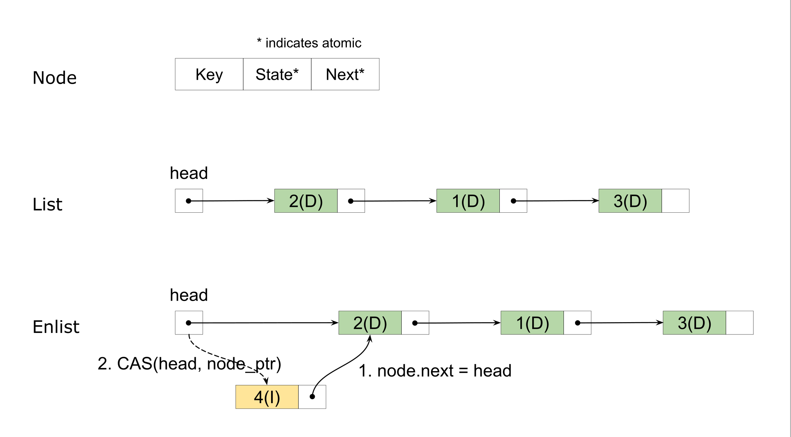

## 缘起

俗话说的好，作为一个在数据库团队做 Kubernetes 开发的同学，不能做到编写 B 树至少要做到心里有 B 数。因此最近闲暇时间一直在研究可持久化的 B 树怎么写，接着就了解到了 BwTree（微软 14 年提出的无锁 B 树），然后开始思考其中的 mapping table 怎么实现，然后开始看 FasterKV（微软 18 年提出的可持久化无锁 KV），然后就彻底跑偏了...

本文主要记录我拿 Rust 折腾几个无锁数据结构的经验和教训，这样以后不记得了还能翻一翻，并告诉自己：

> 没事别瞎折腾什么劳什子无锁编程！

## 数据结构

通常，无锁数据结构的实现都要求有一些特殊的硬件支持，例如支持原子 compare-and-swap (CAS) 操作的处理器，或是[事务型内存（transactional memory）](https://en.wikipedia.org/wiki/Transactional_memory)。目前，主流的处理器都已经支持了 CAS 操作，因此大部分无锁数据结构是基于 CAS 操作设计的。通常来说，CAS 操作只能作用于 32/64 位整数，正好放下一个指针，因此各种无锁结构都围绕着指针的原子操作而设计。本文也将主要介绍一种无锁链表在 Rust 中的实现，链表算法主要基于 Zhang et al. 在 2013 年提出的一种无锁无序链表 [1]。

### 无锁链表（Unordered Set)

首先介绍一下上述提到的无锁链表，它其实是一个结构为单向链表的无序集合，包含以下 3 种操作：

+ `insert(k)`，插入一个元素 `k` 并返回是否成功；
+ `remove(k)`，删除一个元素 `k` 并返回是否成功；
+ `contains(k)`，判断一个元素 `k` 是否在集合（链表）中；

链表的节点和整体结构如下图所示：



其中每个节点除了包含本身的元素以外，还有两个原子变量：

+ state，代表了当前节点的状态，论文中状态的定义有 4 种：
  + DAT，表示可见的元素（节点）
  + INS，表示插入中的元素
  + REM，表示删除中的元素
  + INV，表示无效的元素（节点）
+ next，存储了下一个节点的指针

和通常的单向链表一样，链表有一个 `head` 指针指向链表头，然后通过节点上 `next` 中存储的指针串联起来。当需要插入一个新节点的时候，使用 CAS 原子操作将 `head` 修改为新节点的地址，如图所示。当然 CAS 操作是可能会失败的，此时我们只需要重新进行图中的步骤。Rust 代码大致如下：

```rust
fn enlist(&self, node_ptr: SharedNodePtr<E>, g: &Guard) {
    debug_assert!(!node_ptr.is_null());
    let node = unsafe { node_ptr.deref() };
    let mut head_ptr = self.head.load(Ordering::Acquire, g);
    loop {
        // Set node.next to untagged(head).
        node.next.store(head_ptr.with_tag(0), Ordering::Release);   
        match self.head.compare_exchange(
            // Keep head's tag.
            head_ptr, node_ptr.with_tag(head_ptr.tag()),                      
            Ordering::AcqRel, Ordering::Acquire, g
        ) {
            Ok(_) => return,
            Err(err) => head_ptr = err.current,
        }
    }
}
```

假如不考虑链表节点的删除，基于无锁链表的无序集合其实很容易实现 -- 添加只需要在链表头插入对应元素的节点 (DAT)，删除同样插入一个节点，只不过标记状态为删除 (REM)。集合元素的查找只要顺序遍历链表，直到找到第一个拥有相同元素的节点，那么节点的状态就是元素的存在状态。这种简单的方式显然有一个比较大的问题，那就是链表会越来越长，而集合操作的复杂度和链表长度是正相关的。因此 Zhang et al. 提出的算法引入了 INS 和 INV 两种状态，并包含了节点的删除操作。

在上述 3 种操作中，`contains` 是一个只读操作，因此实现它只需要按照链表无脑向下寻找就可，直到找到第一个可见的元素。在不考虑 GC 的情况下，只读操作永远都能正常运行。另外两个操作是比较类似的：它们都在链表头插入了一个包含了对应元素的节点，然后从该节点开始往后探查是否操作成功。算法流程大致为：

+ `insert` 插入状态为 `INS` 的节点，并向后找到第一个元素相同的节点
  + 节点状态为 `INS` 或者 `DAT` 则表明链表中已经存在该元素了，表明插入失败；
  + 节点状态为 `REM` 则表明链表中该元素已经被删除了，表明插入成功；
  + 节点状态为 `INV` 的忽略；
  + 未找到，则插入成功；
+ `remove` 插入状态为 `REM` 的节点，并向后找到第一个元素相同的节点
  + 节点状态为 `REM` 则表明链表中该元素已经被删除了，表明删除失败；
  + 节点状态为 `INS` 则表明有另一个线程正在插入该元素，尝试使用 CAS 标记为 `REM`；
    + 成功，表明删除成功；
    + 失败，则重新读取节点状态重试；
  + 节点状态为 `INV` 的忽略；
  + 节点状态为 `DAT` 则尝试用 CAS 标记为 `REM`，CAS 的成功/失败代表删除的成功/失败；

在插入和删除的向后查找过程中，如果遇到 `INV` 的无效节点，则会尝试使用 CAS 删除该节点，从而达到缩短链表的目的。

```rust
CAS(prev.next, cur_ptr, cur.next)
```

在基于 CAS 的无锁链表算法中，通常会遇到两个问题：

1. ABA 问题：即在一个线程 1 进行原子 CAS 操作前，它看到的是 A，此时另一个线程 2将它修改为 B，然后又修改回 A，然后线程 1 再进行 CAS 操作时将会成功完成操作并可能破坏数据结构；
   + 在本文描述的算法中不会出现 ABA 问题，因为其中的任意一个原子变量都不会出现值循环的修改（state 是有顺序的，next 一定是间隔向后修改，而链表中间不会有插入）；
2. 并发删除问题：当链表为 A -> B -> C -> D 时，线程 1 和线程 2 并发删除 B 和 C 可能会导致 C 的删除无效化/被取消：
   + 无效化：线程 1 删除 B，此时链表为 A -> C -> D，此时链表 2 看到的链表还是 B -> C -> D，它将 B.next 设置为 D 对原链表无影响；
   + 被取消：线程 1 读取 B.next 为 C，此时 线程 2 删除 C，链表为 A -> B -> D，然后线程 1 执行 CAS(A.next, B, C) 成功，链表又恢复到了 A -> C -> D；
   + 并发删除问题在该算法中是存在的，但是并不影响正确性，因为被删除的节点一定是 `INV` 状态的，而该状态的节点不会影响任何操作；

在 Java 等 GC 语言中，并发删除问题并不是一个大问题，而在无 GC 的语言中，并发删除会让节点 GC 变得更难，这在后续的 GC 小节中会分析问题和解决。

上述算法三个操作的时间复杂度都是 O(n) 的，因此在集合大的时候性能不是很好。同样，指针本身会带来巨量的 cpu cache miss，因此无锁算法通常单线程性能比普通的非并发算法要差的多。

### 无锁哈希表

在哈希表中通常使用链表来解决哈希冲突的问题，那当我们拥有一个无锁链表，自然而然的可以构建一个无锁的哈希表，它包含以下几个操作：

+ `put(k, v)`，将 k 映射到 v
+ `remove(k)`，删除 k 上的映射
+ `get(k)`，获取 k 上映射的值

显然，我们只需要和普通的哈希表一样准备一组 buckets，每一个 bucket 指向一个无锁链表就可以轻松地构建出一个无锁哈希表。这样的无锁建立在无法增加或是减少 buckets 的基础上。在 SIGMOD 2018 上微软发表了关于 FasterKV 的论文[3]中提到，通过结合 epoch 框架提出了一种无锁扩缩容的方式，按照我的理解仍然是一个变相的自旋锁，这里不做详细介绍。

为了进行实验，我也用 Rust 实现了 FasterKV 的内存版本（不带扩缩容的能力），在实现小节中会呈现实验结果。

## 垃圾回收（GC)

现代的高级编程语言通常都会提供内存 GC 的能力，例如 Java、Go、Python 以及一众基于 JVM 的语言等等。只有一些偏向底层的“倒霉”语言才没有 GC，Rust 是属于新晋的这一类编程语言之一。在 Rust 中，编译器会自动将内存释放的相关代码编织到程序中，这种方式大约是借鉴的 C++ 的 RAII。但是在无锁数据结构中，无锁的并发访问会带来一个额外的问题：什么时候对象以及它的内存才是可以安全回收的？

考虑这样一个场景：线程 1 删除了链表中的一个节点，但线程 2 此时还在访问这个节点，这在无锁并发场景下是成立的。此时，这个节点还不能被安全回收，但我们都知道它最终将不可能被访问到。因此无锁情况下的垃圾回收方法主要需要解决的如何找到一个时刻，此时被删除的对象已经不可能在访问到了。著名的 GC 方法有 QSBR（Quiescent-state-based Reclaimation）、EBR（Epoch-based Reclaimation）和 HPBR（Hazard-pointer-based Reclaimation）等，本文主要介绍和使用其中的 EBR 这一种方法。

### Epoch-based Reclaimation


## 实现


## 参考文献

[1] Zhang, Kunlong, et al. "Practical non-blocking unordered lists." International Symposium on Distributed Computing. Springer, Berlin, Heidelberg, 2013.

[2] Harris, Timothy L. "A pragmatic implementation of non-blocking linked-lists." International Symposium on Distributed Computing. Springer, Berlin, Heidelberg, 2001.

[3] Chandramouli, Badrish, et al. "Faster: A concurrent key-value store with in-place updates." Proceedings of the 2018 International Conference on Management of Data. 2018.

[4] <https://github.com/crossbeam-rs/crossbeam>

[5] <https://en.wikipedia.org/wiki/ABA_problem>
