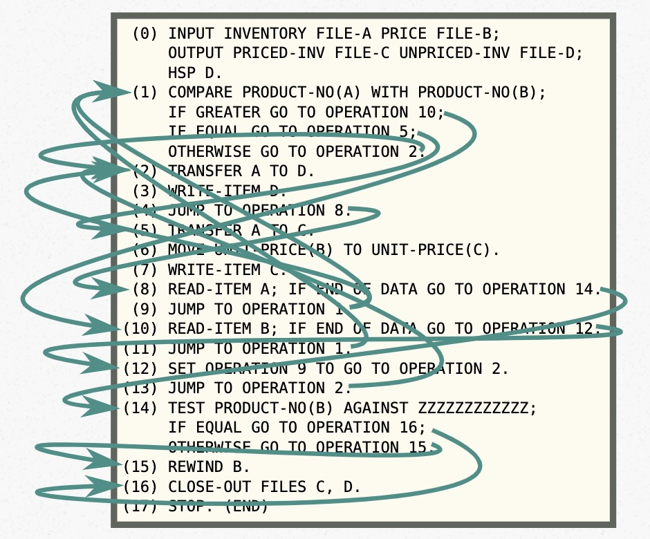
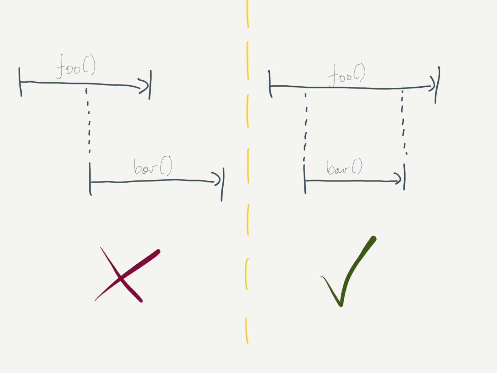
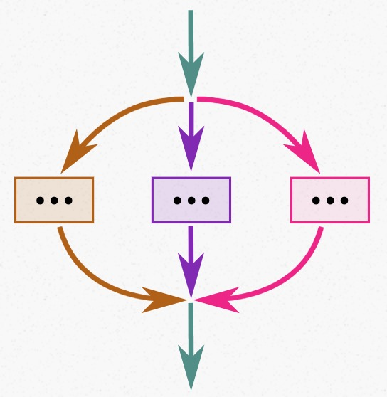
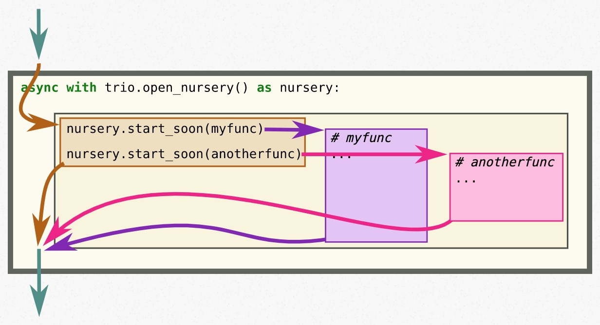

> 最近阅读的几篇文章都是围绕着编程来的。在我看来，编程语言/模型/抽象的一大重要目的是在保证核心功能和性能的基础上，让开发人员更容易地开发出不易出错的、高效的程序，都是为人服务的。并发编程通常被认为是难以编写且容易写出缺陷的，因此我也希望能有一个良好的抽象使并发编程更加的容易。

结构化并发（Structured Concurrency）是一个近年来才被提出的概念，主要目的是提高并发编程的确定性、质量和开发效率。结构化并发的中心思想是对并发的执行流进行封装，使得它们能够有确定的入口和出口。

起初我是在调研 tokio 的 scope spawn 的时候了解到结构化并发的。在深入调研之后，我认为这种思想有助于更高效地写出更鲁棒的并发代码，因此决定在此详细介绍一下它的由来、思想和现状。

本文部分参考了结构化并发的经典文章[[2]](https://vorpus.org/blog/notes-on-structured-concurrency-or-go-statement-considered-harmful/#nurseries-a-structured-replacement-for-go-statements)。这篇文章介绍了作者对结构化并发的思考和一个 Python 的结构化并发开发工具 nursery，感兴趣的同学可以读一读。

## 由来 -- 抽象破坏者

为了使开发者能够高效地开发程序，现代编程语言通常都遵循结构化编程的模式，并提供了这样的一个抽象：你可以将程序的一部分当做黑盒来使用，且控制流一定遵循 **调用者 -> 黑盒 -> 调用者** 的方式进行转移。举个例子：

```go
// Go
fmt.Println("Hello world")
```

我们不需要关心 Println 里面到底做了什么，只需要知道最后它完成输出之后会将控制权交还，在这之中发生的所有的事情都是 **受控制的**。这种抽象使得开发者不需要记住程序的所有实现细节，而只需要关注在我们想要的事情之上。如果没有这个抽象，我们就必须了解程序的所有细节，显然对于现代的编程工作来说是不可能的。

### goto

第一个抽象破坏者出现在编程时代的早期，或者说它是这种抽象的原因之一，它就是大名鼎鼎的 `goto`。在上个世纪 50 年代，人们开始研发一类新的编程语言。有别于更贴近机器的语言（像汇编），这类编程语言的目的是让人能更好地编写程序。其中一种语言叫 FLOW-MATIC。

FLOW-MATIC 中没有 if，没有循环，也没有函数调用，但它有一个操作叫 JUMP -- 可以跳转到指定的任何一个位置。同样，FLOW-MATIC 中也没有函数的概念，因此一个用该语言编写的程序，它的控制流可能长这样[2]...



FLOW-MATIC 中的 JUMP 就是最早的 `goto`，它不受任何限制，可以跳转到任何你想跳转的地方。可以想见，如果存在这种东西，上述的黑盒抽象将不复存在。因此在像 C 这类近代语言里，goto 被严格限制在一个函数内，从而保证了抽象的有效性。

### go

第二个抽象破坏者是由并发编程带来的。在可以并发的世界里，新启动一个并发单元意味着在当前控制流之外另外有一条新的控制流将要开始执行。我们将面临几个问题：

+ 新的控制流什么时候运行/结束？
+ 谁来回收新控制流使用的资源？
+ 谁来处理新控制流可能的报错？
+ 可以中止新控制流的执行么？

我们以 Go 为例，举一个简单的例子。假设有一个第三方库提供了这样一组结构体/函数：

```go
// Go
type Result struct {}
func (r *Result) Read(p []byte) (n int, err error) {}
func HttpGet(url string) Result {}
```

当我们遵循最初的抽象的时候，我们可以直接的做出如下理解：`HttpGet` 是请求给定 URL 并读取结果返回给调用者，调用者可以通过调用 `Result.read` 来获取结果的内容。在编写代码的时候，我们就可以简单地调用 `HttpGet`。

```go
// Go
func JustGet(url string) {
    lib.HttpGet(url)
}
```

当代码完全是同步实现的时候，so far so good。然而，当面临并发编程原语 go 时，事情一下子变的复杂了起来。假设上述结构体/方法的实现是下面这样的：

```go
// Go
type Result struct {
    ch    chan []byte
    buf   *bytes.Buffer
}

// Implement io.Reader.
func (r *Result) Read(p []byte) (n int, err error) {
    if r.buf == nil {
        if buf, ok = bytes.NewBuffer(<-r.ch); ok {
            r.buf = buf
        } else {
            r.buf = &bytes.Buffer{}
        }
    }
    return r.buf.Read(p)
}

func HttpGet(url string) Result {
    ch := make(chan []byte)

    go func() {
        defer close(ch)

        resp, err := http.Get(url)
        if err != nil {
            return
        }
        defer resp.Body.Close()
        content, err := io.ReadAll(resp.Body)
        if err != nil {
            return
        }

        ch <- content
    }()

    return Result{
        ch: ch,
    }
}
```

HttpGet 在执行时启动了一个 goroutine 用于异步进行 HTTP 请求，但是立即返回了当前函数！而我们知道，在面对网络 IO 的时候，令人担忧的事情总是会发生：这个 HTTP 请求可能会卡很久，也可能永远不会结束（暂不考虑超时）。极端情况下，当越来越多的 `JustGet` 被执行时，我们的主控制流虽然总是能结束，但后台会堆积越来越多的 goroutine -- 程序的行为开始不受控制了！

在这里，go 对控制流的抽象进行了第二次破坏。对比 goto 和 go，你会发现它们是极为相似的[2]。


不仅如此，因为 线程/go 为代表的并发控制的出现，许多在非并发世界里很自然的事情变难了：

+ 优雅退出，在并发的世界里意味着要停止所有的异步执行流
+ 自动资源回收，典型例子是 RAII 和 Python 的 ContextManager
+ 错误处理，在非并发的世界里，错误的处理可以由当前控制流上注册的处理器完成，而在 goroutine 中，如果没有特别注册 panic 处理当前进程会立即崩溃
  + 在我给 Kubernetes 社区提交的一个 PR 中，reviewer 特别提到了对 goroutine panic 的处理

```python
# Python
with open('/some/file') as f:
    ...
# Async flow outlives here
```

> 最后，我想同学可能会对这个例子有疑问：如果文档足够详尽或者方法改名为 AsyncHttpGet 会不会使得开发者避免这样的错误？
>
> 我个人的见解是：没错，但是并不能解决所有问题。现实往往比理想更让人无奈：
>
> + 如果库的提供者不够娴熟/偷懒/脑子抽了呢？
> + 如果开发者没有仔细阅读文档而是依赖直觉呢？
> + 如果这个是一个间接依赖而非直接依赖呢？
>
> 我们毕竟只是人类，只能处理有限的复杂度，而且很容易出错。上面这些每一条都导致了无数真实世界的缺陷。举一个例子，Kubernetes 中 `kubectl exec` 中使用的 `SPDYExecutor` 至今还存在 goroutine 泄露和卡死（SIGINT 失效）的可能，而这可是 Google 和世界上许多优秀工程师一直在维护的项目。

## 思想 -- 结构化并发



正如前文所说，go 这样的并发原语是强大但需要仔细控制的，因此我们需要额外的抽象来让并发变得更为可控。对应结构化编程（Structured Programming）， Martin Sústrik 和 Nathaniel J. Smith 提出并细化了结构化并发的概念。

结构化并发的核心思想是：每当控制流分裂成几条并发的控制流时，保证它们最后会合并起来。举个例子，假设我们要并发地进行三件事情，它们最后会合并到一起（回到主控制流）。

 

在 Smith 开发的 trio 库中，nursery 代表了一个结构化并发的控制器 -- 所有并发单元必须在 nursery 中启动，nursery 会等待所有的并发任务结束。Nursery 保证了在它被关闭时，所有的并发单元都已经执行结束/被取消了。因此使用 nursery 能够继续保证一开说所说的黑盒抽象。

使用 nursery 我们同样可以动态地启动并发任务，但看上去它一定需要事先创建一个 nursery 对象？岂不是并发任务的生命周期一定和 nursery 对象绑定了？显然这个问题有一个很简单的解决办法：当我们需要一个不限制生命周期（aka. 生命周期和程序一样长的）的并发任务时，我们可以用一个全局静态的 nursery 来创建它。

不仅如此，nursery 所代表的结构化并发思想同时可以解决我们上面所说的问题：

+ 优雅退出，nursery 支持取消异步任务，并会一直等待异步任务结束
+ 自动资源回收，因为黑盒原则的保证，异步任务的生命周期可以保证比资源长
+ 错误传播，同样因为控制流的合并，错误可以从分裂的控制流正确地传播到主控制流，并被处理

What's more? 在结构化并发中可以更自然和鲁棒地实现超时和取消，因为一切并发结构都和以前一样是树状的。在异步 IO 中鲁棒的超时实现是非常重要的，因此关于超时和取消也是一个很有意思的话题，等有时间了会开一篇新的文章聊一下。

除了 nursery 之外，截止到目前我已知的已经实现/正在实现结构化并发的编程语言和项目有 Python 的 trio [8]、Kotlin [9]、Java 的 loom [7] 以及 Swift [10]。Rust 的 tokio 异步运行时曾经尝试过提供结构化并发的能力，但无奈现在的 Rust 特性还不能够支撑结构化并发。

> 注：ForkJoin 模型同样也实现了控制流的等待，但 Smith 并不认为它是结构化并发。因为编程语言并不了解 fork-join 的语义，无法在编译期保证并发安全。

## 现状 -- 无能为力的 Rust


Carl Lerche 尝试在 tokio 的 issue [4] 中提出了一个结构化并发的提案，意图一举支持 scoped spawn（参阅 [6]）和结构化并发两个功能。然而经过一番讨论后发现，在目前的 Rust 中无法实现 scoped spawn，也无法完善地支持结构化并发。原提案的讨论比较发散，因此有一点难以理解，这里主要讲述我个人的见解 [11]。

不是很熟悉 Rust 和 tokio 的同学可以先不用管其他细节，只需要记住目前有两个主要限制：

+ Rust 的协程 Future 的取消依赖 Drop（等价于析构函数），它是立即执行的
+ tokio 中只支持 spawn 一个 static 生命周期（没有局部变量引用）的 Future，与之相对应的就是 scoped spawn

举两个简单的例子方便理解，熟悉的同学可以直接跳过：

```rust
// Rust
async fn request_or_timeout(tiemout: time::Duration) -> Result<()> {
    let timer = tokio::time::sleep(timeout));
    let request_fut = async_do_request();

    tokio::select! {
        _ = timer => {
            // request_fut is dropped immediately before exiting current block
            Err("timeout")
        },
        _ = request_fut => {
            Ok(())
        }
    }
}

async fn scoped_spawn() {
    let x = 1;
    let x_ref = &x;

    // Not allowed
    tokio::spawn(async {
        println!(*x_ref);
    }).await;
}
```

那现在问题在哪呢？假如 Rust / tokio 中已经支持了结构化并发，我们尝试来反推一下。这要求我们了解 Rust 协程和运行时的真正执行流程，不熟悉的同学可以参考我上一篇[介绍协程的文章](../coroutines-rust-and-go)。

首先，假如 Rust / tokio 已经支持了结构化并发，那支持 scoped spawn 应该是一个非常自然的事情 -- 因为控制流永远都会归并，意味着你可以保证 scoped 引用的生命周期一定比 spawned task 要长。因此我们需要来看一下如何支持 scoped spawn。注意到 spawn 出来的任务是异步并发执行的，意味着你无法保证在任意时刻都能够立即中止它的运行。注意到有 select 这种原语的存在，因此任意 Future 都可以在没有执行完前被 drop（强制立即取消 + 销毁）。

那么这里矛盾来了，以上面的 `scoped_spawn` 为例：

+ scoped_spawn 所代表的 Future 可以被强制销毁
+ 此时它 spawn 的 println 任务可能还在运行中，保证 x_ref 的有效性，需要保证 scoped_spawn 不被销毁

如何保证 scoped_spawn 被 drop 前 println 这个并发任务完成/取消？答案是，很遗憾，没有办法。Rust 没有提供一个异步取消的方式，除非在 drop 中用一种阻塞线程的方式来同步等待，第一这是不可取的（你无法知道要等多久），第二 Rust 的编译器也没有这个能力自动插入跟 runtime 相关的阻塞等待方式。

显然，这里我们缺少一个异步取消的机制。关于这个机制其实 tokio 社区很早就讨论过。在支持异步 IO 驱动器 io_uring 的过程中发现，io_uring 对传入内核的 buffer 的生命周期有要求：必须保证内核在工作期间 buffer 是存活的。这对使用 Drop 来取消协程的 Rust 来说遇到了和上面一样的问题。因此社区基于此提出了需要一个 AsyncDrop [12] 的 trait 来完成异步 Drop。但同样，即使是 AsyncDrop 也仍然未有定论，比如其通用的形式

```rust
trait AsyncDrop {
    async fn drop(&mut self);
}
```

就有好几个问题：async trait 不支持，async trait 的支持需要 GAT（generic associate type），GAT 还没有 stable。Just too many problems ahead。咳，这里不做展开。

除了异步取消，我们还面临了错误传播和处理的问题，其中最头疼的应该是 panic 的处理，我想本文已经够长（水）了，就不再继续讨论了。

总而言之，Rust 的异步编程以及结构化并发的支持还有很长一段路要走。虽然看着隔壁 swift 的完整 proposal 有一点流口水，但还是期待将来能在 Rust 上完整体验结构化并发的魅力。

> 关于 Rust 异步编程目前存在的一些问题，感兴趣的同学可以参阅 [6]。

## 总结

关于编程，我始终认为其模型的设计应该是以人为导向的。编程语言和其所对应的模型应当是辅助人去完成复杂算法/系统的设计与实现。因此，我认为结构化并发是一种优雅且有效的并发编程模型，在这种模型下思考许多并发算法的实现能显著降低心智负担，使得我这种普通开发者写出更鲁棒的并发代码。

其实，在异步和并发编程领域还有一个我非常感兴趣的话题 -- 超时和取消，期待后续能够有机会写（水）一篇文章探讨下。

最后，互相交流想法是我写文章的主要目的之一，希望各位大佬能够多在评论区互动。

## 预告

下一篇文章水一下老本行，聊聊 Kubernetes 中实现 operator 模式的几个注意点。

## 参考文献

[1] <https://arunsworld.medium.com/structured-concurrency-in-go-b800c7c4434e>

[2] <https://vorpus.org/blog/notes-on-structured-concurrency-or-go-statement-considered-harmful/#nurseries-a-structured-replacement-for-go-statements>

[3] <https://en.wikipedia.org/wiki/Structured_concurrency>

[4] <https://github.com/tokio-rs/tokio/issues/2596>

[5] <http://smallcultfollowing.com/babysteps/blog/2019/10/26/async-fn-in-traits-are-hard/>

[6] <https://carllerche.com/2021/06/17/six-ways-to-make-async-rust-easier/>

[7] <https://wiki.openjdk.java.net/display/loom/Structured+Concurrency>

[8] <https://github.com/python-trio/trio>

[9] <https://elizarov.medium.com/structured-concurrency-722d765aa952>

[10] <https://github.com/apple/swift-evolution/blob/main/proposals/0304-structured-concurrency.md>

[11] <https://gist.github.com/arkbriar/39b30ac4a882277372dacbb85eb6cdd2>

[12] <https://boats.gitlab.io/blog/post/poll-drop/>
