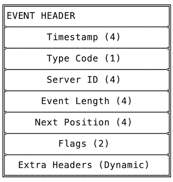
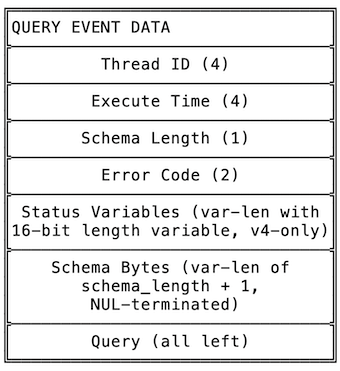

Although the article was originally written in Chinese, with the help of ChatGPT, I was able to provide an English translation. If you want to read the English version, please jump to [here](#why-do-we-need-to-reinvent-the-wheel) for reading.

## 为什么要再造一个轮子？

> 造轮子是程序员的浪漫！🥰

在前东家工作的时候，我设计了一个分布式场景下的备份恢复方案需要解析和操作 binlog。当时，我比较想要一个干净没有依赖的工具，因此没有选择用成熟的 Java 的库，而使用 Go 来进行了实现。在实现的过程中，我尝试了一些比较有意思的方式。最终效果是我用一周时间糊完了整个解析部分，并且支持了像模糊搜索等的一些比较有意思的功能，堪堪赶在跑路前完成。本文主要是记录一下当时的一些想法和其中一些有趣的部分。

本文的代码[在 Github 上](https://github.com/polardb/polardbx-operator/tree/main/pkg/binlogtool)，感谢前司同事们继续维护并最终将它开源。

## 简单介绍 Binlog

Binlog 是 binary log 的缩写，通常指 MySQL 中实现的二进制日志。Binlog 包含了一系列的用来描述数据库变更情况的**事件**，例如建表、删表、增删改查等等。在 binlog 中，每一个事件都被编码成一段连续的二进制内容，其中包含了：
  
- 固定的事件头，包含了事件类型、时间戳、事件长度等等；
- 事件体，对每一个不同的事件类型事件体的内容和编码方式都不同；



Binlog 解析器的工作就是把编码后的事件解析成一个个内存中程序可操作的对象。值得注意的是，在 binlog 的衍化过程中，出现几个不同的版本，它们分别是 v1, v3 和 v4。其中 v2 从来没有正式发布过，因此可以忽略[1]。

关于 binlog 的详细介绍网上有很多资料，这里不再赘述。你可以参考[官方文档](https://dev.mysql.com/doc/refman/8.0/en/binary-log.html)或是其他资料。

## 一些有趣的尝试

通常来说，解析器这种东西都是体力活。特别是针对 binlog 这种编码方式稳定、事件数量几乎固定的日志，实现一个解析器最好的办法就是对每一个事件硬编码一个解析函数，例如 `go-mysql` 中对 `ROWS_EVENT` 的[解码函数](https://github.com/go-mysql-org/go-mysql/blob/master/replication/row_event.go#L86-L145)的实现。这样的实现方式性能好，但是阅读起来非常费劲。同时，因为 Go “大道至简”的错误处理方式，编写出来的代码常常到处都是 `if err != nil`。而且二进制编解码的调试实在是费劲，想要尽快实现迫使我考虑一些其他的方法。

```go
func (e *TableMapEvent) Decode(data []byte) error {
	// ...

	var err error
	var metaData []byte
	if metaData, _, n, err = LengthEncodedString(data[pos:]); err != nil {
		return errors.Trace(err)
	}

	if err = e.decodeMeta(metaData); err != nil {
		return errors.Trace(err)
	}

	pos += n

	// ...

	if err = e.decodeOptionalMeta(data[pos:]); err != nil {
		return err
	}

	return nil
}
```

### 迭代器接口

相比于回调接口，我更喜欢迭代器式的接口。因此，在我的实现中，接口是这样的：

```go
type LogEventScanner interface {
	Next() (EventOffset, event.LogEvent, error)
}
```

### 声明式的解析器

经过我一番研究之后，我发现虽然整个编码方式看起来很复杂，但大部分都是一些固定的组合。例如，对各种整数的编码通常都是一样的经典 variable-length 编码，而对字符串的编码则大概率是下面几种方式的其中一个：

- 一个编码后的整数代表长度，后面是对应长度的字节
- NUL 结尾的字节串
- 和第一种方式一样，同时结尾有 NUL

显然这些相同的编码方式可以变成一个个函数来调用。但是，使用函数并不能够避免连续而繁琐的错误处理。实际上，当时的我受到 SwiftUI 等框架的影响，脑中早就想到了一个方法：它需要把事件解码方式的声明和解码动作解耦，这样我就可以不用在调整事件布局的同时关注错误的处理了。类似地，我将这种方式实现的解析器成为一个声明式的解析器。与 SwiftUI 等框架相同，使用这种方式编写的代码在简单场景下非常精简，且极大地提高了可读性。

在这种方式中，事件的解析过程使用一个 `Layout` 函数来声明（定义）。之所以用函数而不是 `XxxLayout` 结构体，是因为这种方式并不灵活。使用闭包可以完美地解决问题，我可以在闭包中塞各种临时状态，并且利用闭包的特性把它们传到各处。以下是 `QueryEvent` 的例子：

```go
type QueryEvent struct {
	ThreadID   uint32          `json:"thread_id,omitempty"`
	ExecTime   uint32          `json:"exec_time"`
	ErrorCode  uint16          `json:"error_code"`
	Schema     str.Str         `json:"schema"`
	Query      str.Str         `json:"query"`
	StatusVars StatusVariables `json:"status_vars,omitempty"`
}

func (d *QueryEvent) Layout(version uint32, code byte, fde *FormatDescriptionEvent) *layout.Layout {
	var schemaLength uint8
	var statusVarsLength uint16
	return layout.Decl(
		// Post header
		layout.Number(&d.ThreadID),
		layout.Number(&d.ExecTime),
		layout.Number(&schemaLength),
		layout.Number(&d.ErrorCode),
		layout.If(version == spec.V4, layout.Number(&statusVarsLength)),

		// Payload
		layout.If(version == spec.V4, layout.Area(&statusVarsLength, func(data []byte) (int, error) {
			return int(statusVarsLength), d.StatusVars.parseStatusVarsBlock(data)
		})),
		layout.Bytes(&schemaLength, &d.Schema),
		layout.Null(),
		layout.Bytes(layout.Infinite(), &d.Query),
	)
}
```

相信即使你现在看不懂 `layout.Number` 等的是什么，你也能很快理解这就是在说 `QUERY_EVENT` 编码后的布局是这样的：



从 `layout.Number` 调用方式，我相信你已经能猜出这是怎么实现的了 -- 它就是一个绑定到 `&d.ThreadID` 这个 `int32` 类型的变量的一个解码器。对于不同的类型，我在 `layout` 包中实现了不同的解码器，我将它们称为 `Field`。以下是 `Number` 的实现：

```go
type NumberField[N constraints.Integer | constraints.Float] struct {
	r *N
}

func (f NumberField[N]) FromBlock(data []byte) (int, error) {
	if err := checkDataSize(int(unsafe.Sizeof(N(0))), data); err != nil {
		return 0, err
	}
	utils.ReadNumberLittleEndianHack(f.r, data)
	return int(unsafe.Sizeof(N(0))), nil
}

func Number[N constraints.Integer | constraints.Float](r *N) NumberField[N] {
	return NumberField[N]{r: r}
}
```

最后依样画葫芦把所有事件类型都支持了就行。在这个过程中，繁琐的函数调用和错误处理不再是我写码的阻碍，反而是 MySQL 中恶心的编码方式和不详细的文档不时阻碍着我的步子 -- 大部分时候，我必须要翻着 MySQL 的代码来理解为什么是这样编码的。

有细心的同学可能会问了，这种方式会不会解码每一个事件都要生成一堆的 `Field` 小对象，会不会对性能有很大影响？你是对的，确实很影响，但也不是没有办法 🥵。 Binlog 的特性决定了它的解析过程一定是一个确定性的过程，意味着在确定了要解析哪条日志后，不管是日志中的哪个事件它的解码过程都是确定的 -- 这提示了可以对每一个事件都缓存 `Layout` 的结果。在糊完了大部分事件之后，我就实现了这样的一个 cache。想要详细了解的可以参考的 [binlog/cache.go](https://github.com/polardb/polardbx-operator/blob/main/pkg/binlogtool/binlog/cache.go) 这个文件。

最终测试后，大约性能是单线程全字段解析约为 200 MB/s，测试环境是 MacBook Pro 13'' 2019, Intel。在我看来是完全足够的了，毕竟谁家的 binlog 写的速度有 200 MB（不考虑大事务），这么好的磁盘请一定邮寄给我测试一下。

### 模糊探测事件头

有了解析器之后，我就可以造我自己的 CLI 工具了（嘿嘿嘿 😃）。如果你用过 `mysqlbinlog` 这个工具来查看过 binlog，相信你一定会用到 `--start-position` 这个参数来快速跳转到某个事件的开头。然而，由于 binlog 流式的特征，如果你指定的位置不是事件头，`mysqlbinlog` 就无法继续读下去了，它非常光棍地直接报错了 :) 是的，这很让人难受。这意味着我必须另外开一个计算器咔咔算出事件位置，然后再丢给 `mysqlbinlog`。每当这个时候，我都在想如果能随便帮我找到下一个事件输出就好，这样我很快就能二分找到想要的事件。

理论上来说，从流里面探测事件的事件头是没法实现的。但幸运的是，现在的场景是文件，而且事件头里面恰好（不知道是不是故意地）留下了冗余信息： `event_length` 和 `next_position` 这两个字段。在读取文件的过程中，我们很容易地就能得知当前的位置，也就是 `current_position`。那么显而易见，`current_position + event_length = next_position` 必须成立。这是一个非常强的特征，如果符合的话，很大概率这个位置是一个合法的事件头。因此，探测的方式就决定是它了！实现的代码可以[看这里](https://github.com/polardb/polardbx-operator/blob/0c9db54f02e832b15dc9b163c9bcf1424b2cd32b/pkg/binlogtool/binlog/scan.go#LL122-L208C2)。

里面用了一个 `ring buffer` 的小技巧来减少内存开销。最终实现的效果就是，随便指定什么开始位置，只要下一个事件在探测长度内都能非常快地找到！

## 尾声和下集预告

当然，造轮子的人永远不会满足，一些花里胡哨的功能也必不可少，例如事件过滤、原始事件、结束位置、事件校验、JSON 输出等等。在解析器的基础上，我同时编写了一个 2PC 事务的分析工具，用来完成我一开始讲的备份恢复方案中的一个步骤（毕竟我还是要吃饭的）。本文主要是简单记录了在实现这个解析器过程中的一些有意思的思考和尝试。下一篇应该会讲讲我的分布式备份方案，完全无锁哦，敬请期待 🥰。

P.S. 方案专利应该快下来了吧，请不要告我...

## 参考文献

[1] https://dev.mysql.com/doc/dev/mysql-server/latest/page_protocol_replication.html#sect_protocol_replication_binlog_version_v4

[2] https://github.com/polardb/polardbx-operator/tree/main/pkg/binlogtool


> Below is the English version translated by the ChatGPT. Thanks for his great contribution!

## Why do we need to reinvent the wheel?

> Building your own tools is the romance of programmers! 🥰

When I was working for my previous employer, I designed a backup and recovery plan for distributed scenarios that required parsing and operating binlog. At the time, I wanted a clean tool without dependencies, so instead of using mature Java libraries, I implemented it in Go. During the implementation process, I tried some interesting approaches. In the end, it took me a week to complete the entire parsing part and support some interesting features such as fuzzy search just before leaving. This article mainly records some of my thoughts at that time and some interesting parts.

This article's code is available on Github (https://github.com/polardb/polardbx-operator/tree/main/pkg/binlogtool). Thanks to my former colleagues for continuing to maintain it and eventually open sourcing it.

## Brief Introduction to Binlog

Binlog is short for binary log, which usually refers to the binary logs implemented in MySQL. Binlog contains a series of **events** used to describe changes made to the database, such as creating tables, deleting tables, inserting/updating/deleting data and so on. In binlog, each event is encoded into a continuous segment of binary content that includes:

- Fixed event header, which includes the event type, timestamp, event length and so on;
- Event body, the content and encoding method of which are different for each type of event.


The job of the Binlog parser is to decode encoded events into objects that can be operated on in memory by a program. It's worth noting that during the evolution of binlogs, several different versions have emerged: v1, v3, and v4. Version 2 was never officially released and can therefore be ignored[1].

There are many resources online that provide detailed information about binlogs, so we won't go into further detail here. You can refer to the official documentation or other sources for more information.

## Some interesting attempts

Generally speaking, a parser is a labor-intensive task. Especially for logs with stable encoding methods and almost fixed number of events like binlog, the best way to implement a parser is to hard-code a parsing function for each event, such as the implementation of the decoding function for `ROWS_EVENT` in `go-mysql`. This implementation has good performance but is very difficult to read. At the same time, because Go's error handling approach is "simplest thing that could possibly work", code written often contains `if err != nil` everywhere. Debugging binary encoding and decoding can be quite challenging too. In order to implement it as soon as possible, I had to consider some other methods.

```go
func (e *TableMapEvent) Decode(data []byte) error {
	// ...

	var err error
	var metaData []byte
	if metaData, _, n, err = LengthEncodedString(data[pos:]); err != nil {
		return errors.Trace(err)
	}

	if err = e.decodeMeta(metaData); err != nil {
		return errors.Trace(err)
	}

	pos += n

	// ...

	if err = e.decodeOptionalMeta(data[pos:]); err != nil {
		return err
	}

	return nil
}
```

### Iterator Interface

Compared to callback interfaces, I prefer iterator-style interfaces. Therefore, in my implementation, the interface looks like this:

```go

type LogEventScanner interface {
	Next() (EventOffset, event.LogEvent, error)
}

```

### Declarative Parser

After my research, I found that although the entire coding method looks very complicated, most of it is a combination of fixed patterns. For example, the encoding for various integers is usually the same classic variable-length encoding, while the encoding for strings is likely to be one of the following methods:

- An encoded integer represents its length, followed by corresponding bytes

- A byte string terminated with NUL

- Same as the first method but with a NUL termination

Obviously, these similar encoding methods can be turned into individual functions to call. However, using functions cannot avoid continuous and tedious error handling. In fact, at that time I was influenced by frameworks such as SwiftUI and had already thought of a way in my mind: it needs to decouple the declaration of event decoding methods from their decoding actions so that I can focus on adjusting event layout without worrying about error handling at the same time. Similarly, I implemented this type of parser as a declarative parser. Like SwiftUI and other frameworks, code written using this approach is very concise in simple scenarios and greatly improves readability.

In this approach, an `Layout` function is used to declare (define) an event's parsing process. The reason why we use a function instead of an `XxxLayout` structure is because this approach isn't flexible enough. Using closures can perfectly solve this problem; I can stuff all kinds of temporary states into closures and use closure features to pass them around everywhere. Here's an example for `QueryEvent`:

```go
type QueryEvent struct {
	ThreadID   uint32          `json:"thread_id,omitempty"`
	ExecTime   uint32          `json:"exec_time"`
	ErrorCode  uint16          `json:"error_code"`
	Schema     str.Str         `json:"schema"`
	Query      str.Str         `json:"query"`
	StatusVars StatusVariables `json:"status_vars,omitempty"`
}

func (d *QueryEvent) Layout(version uint32, code byte, fde *FormatDescriptionEvent) *layout.Layout {
	var schemaLength uint8
	var statusVarsLength uint16
	return layout.Decl(
		// Post header
		layout.Number(&d.ThreadID),
		layout.Number(&d.ExecTime),
		layout.Number(&schemaLength),
		layout.Number(&d.ErrorCode),
		layout.If(version == spec.V4, layout.Number(&statusVarsLength)),

		// Payload
		layout.If(version == spec.V4, layout.Area(&statusVarsLength, func(data []byte) (int, error) {
			return int(statusVarsLength), d.StatusVars.parseStatusVarsBlock(data)
		})),
		layout.Bytes(&schemaLength, &d.Schema),
		layout.Null(),
		layout.Bytes(layout.Infinite(), &d.Query),
	)
}
```

Believe that even if you don't understand what `layout.Number` means now, you will soon understand that it refers to the layout of the encoded `QUERY_EVENT`.


From the `layout.Number` calling method, I believe you can already guess how this is implemented - it is a decoder that is bound to the `int32` type variable `&d.ThreadID`. For different types, I have implemented different decoders in the `layout` package, which I call `Field`. Here is the implementation of `Number`:

```go
type NumberField[N constraints.Integer | constraints.Float] struct {
	r *N
}

func (f NumberField[N]) FromBlock(data []byte) (int, error) {
	if err := checkDataSize(int(unsafe.Sizeof(N(0))), data); err != nil {
		return 0, err
	}
	utils.ReadNumberLittleEndianHack(f.r, data)
	return int(unsafe.Sizeof(N(0))), nil
}

func Number[N constraints.Integer | constraints.Float](r *N) NumberField[N] {
	return NumberField[N]{r: r}
}
```

In the end, I just followed the same pattern to support all event types. In this process, tedious function calls and error handling were no longer obstacles to my coding, but rather MySQL's nasty encoding and lack of detailed documentation occasionally hindered my progress - most of the time, I had to flip through MySQL's code to understand why it was encoded that way.

Careful students may ask whether this approach will decode a bunch of `Field` objects for each event generated, which could have a significant impact on performance? You are right; it does affect performance. However, there is still a solution 🥵. The nature of Binlog determines that its parsing process must be deterministic. This means that once you determine which log needs to be parsed, regardless of which event in the log needs decoding, the decoding process is always determined - this suggests caching the results for each event's `Layout`. After completing most events' layout mapping work haphazardly (i.e., without much care), I implemented such a cache. For those who want more details about it can refer to [binlog/cache.go](https://github.com/polardb/polardbx-operator/blob/main/pkg/binlogtool/binlog/cache.go).

After the final test, the performance of parsing all fields in a single thread is about 200 MB/s. The test environment was MacBook Pro 13'' 2019 with Intel processor. In my opinion, this is completely sufficient since no one's binlog can write at a speed of 200 MB (excluding large transactions). Please send me such a good disk for testing.

### Fuzzy Probe Event Header

With the parser, I can now create my own CLI tool (hehe 😃). If you have used `mysqlbinlog` to view binlogs before, you must have used the `--start-position` parameter to quickly jump to the beginning of an event. However, due to the streaming nature of binlogs, if you specify a position that is not an event header, `mysqlbinlog` cannot continue reading and will simply report an error :) Yes, it's very frustrating. This means that I have to use another calculator to calculate the event position and then pass it on to `mysqlbinlog`. Every time this happens, I wish there was something that could help me find the next output event easily so that I could quickly binary search for what I want.

In theory, it is impossible to detect an event header from within a stream. But fortunately, in this case we are dealing with files and there happens to be redundant information left in each event header (`event_length` and `next_position`). While reading through the file we can easily determine our current position (`current_position`). Therefore it follows logically that: `current_position + event_length = next_position`. This is a very strong feature; if these conditions are met then there is high probability that this location represents a valid event header. Thus we decided on using this method! You can see how it was implemented [here](https://github.com/polardb/polardbx-operator/blob/0c9db54f02e832b15dc9b163c9bcf1424b2cd32b/pkg/binlogtool/binlog/scan.go#LL122-L208C2).

We also utilized some clever tricks like using ring buffers which helped reduce memory overheads significantly. Ultimately what we achieved was being able start searching from any arbitrary point - as long as there exists another subsequent valid events within our detection range!

## Conclusion and Preview of Next Episode

Of course, wheel makers will never be satisfied. Some fancy features are also essential, such as event filtering, raw events, end positions, event validation, JSON output and so on. Based on the parser, I also wrote an analysis tool for 2PC transactions to complete a step in the backup and recovery plan that I mentioned at the beginning (after all, I still need to eat). This article mainly records some interesting thoughts and attempts during the implementation of this parser. The next article should talk about my distributed backup plan which is completely lock-free. Stay tuned 🥰.

P.S. The patent for this plan should be coming soon. Please don't sue me...

## References

[1] https://dev.mysql.com/doc/dev/mysql-server/latest/page_protocol_replication.html#sect_protocol_replication_binlog_version_v4

[2] https://github.com/polardb/polardbx-operator/tree/main/pkg/binlogtool